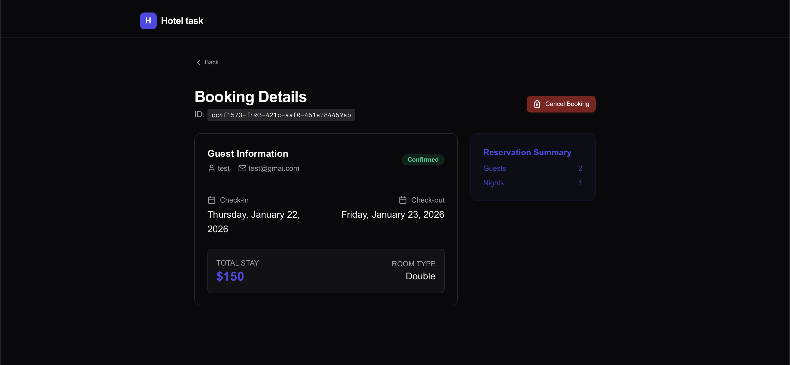
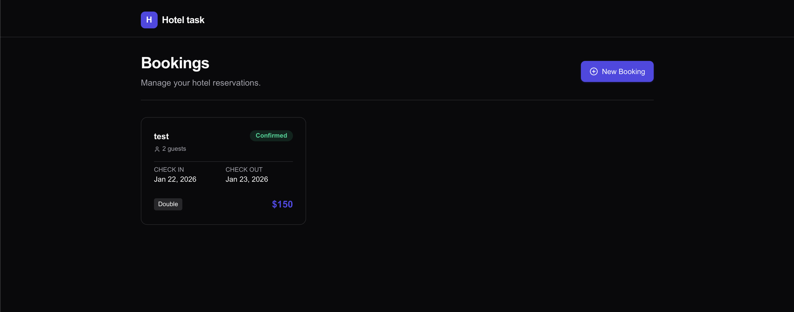
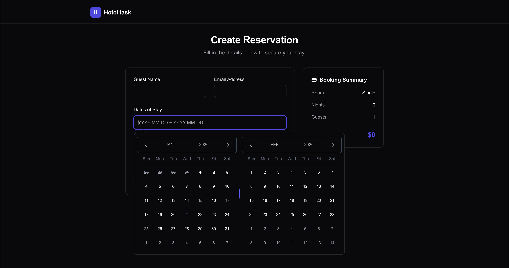
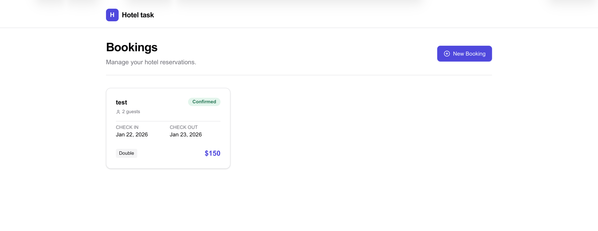
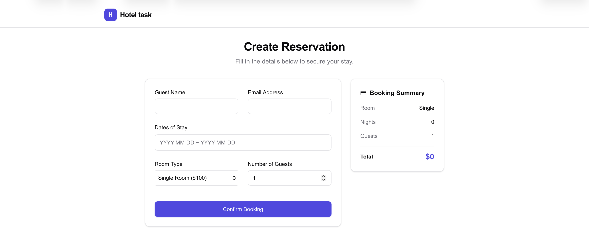
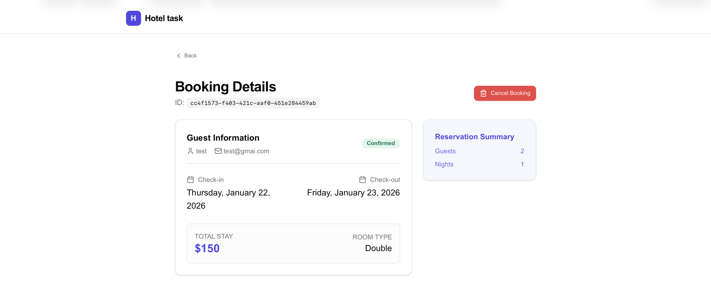

This is a next.js project with tailwind and zustand

## Getting Started

npm run dev

Open [http://localhost:3000](http://localhost:3000) with your browser to see the result.

Time spent: 2-3 hours

## Screenshots

### Dark Mode

### Light Mode

